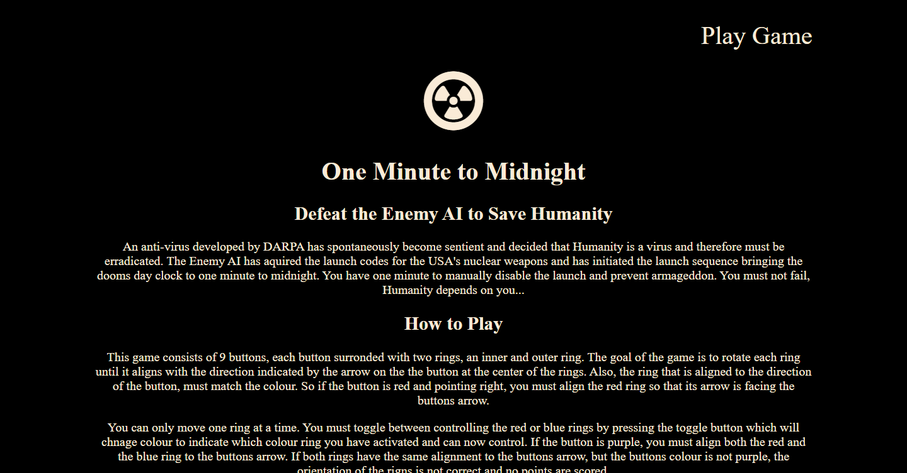
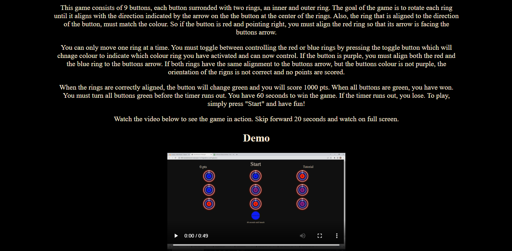
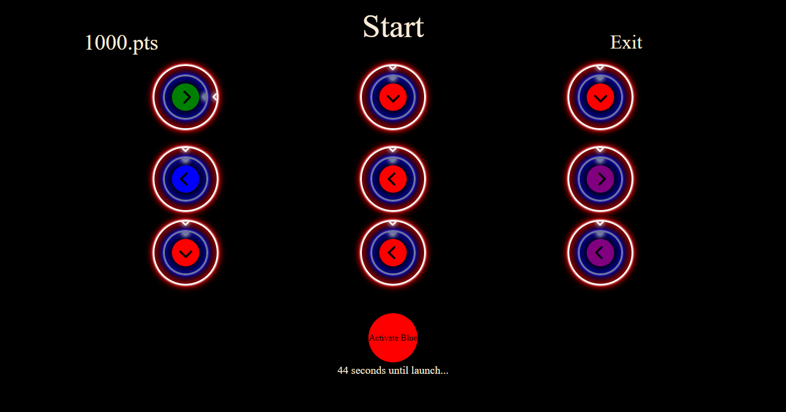
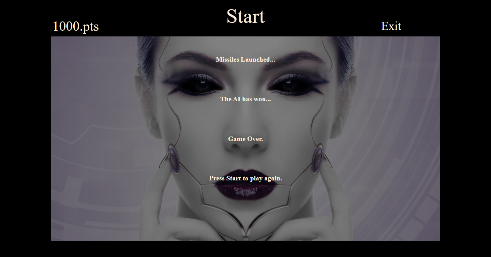

# One Minute To Midnight:
This website was created for casual gamers, and fans of puzzle games. The idea behind this project is to provide light entertainment in the form of a puzzle game that relies on speed and aptitude. The premise of the game simple. To win, match colour and direction indicated by buttons on screen by rotating rings before timer runs out. Users can use a tutorial to quickly learn how to play the game. The simplicity of the game combined with a combined with a very short timer balances intuitiveness with a reasonable amount of challenge.

One Minute to Midnight

## Features:

Existing Features Navigation Bar

Given that the focus of this site is to play a game, the navigation is as basic as it gets. The landing page contains just one link, which brings the user to the game page. Likewise, on the game page, there is just one link bringing the user back to the landing page.

## Landing Page:

This section introduces the user to the theme of the game with a short paragraph setting the scene for the user. Further down the page are instructions on how to play the game. This is supplemented with a short video showing the game in motion.

The layout of the game is simplistic, clear and colourful against a contrasting black background. The game consists of 9 buttons, each surrounded by one red ring and one blue ring and a toggle button used to select the different coloured rings that the player will need to rotate to match the colour and orientation of the button inside the rings.
Across the top of the page, starting on the left-hand side is the points element where the players score is incremented. In the centre is the “start” button which is used to start the game and timer. 

On the right is a link to the Tutorial link that takes the user to a page explaining how to play the game. At the bottom of the page is a toggle button used to select the red or blue rings. 

On the bottom of the page is a toggle button used to select the red of blue rings, depending on the current colour of the toggle button.

Beneath the toggle button is the time which indicates how many seconds are left before the game ends. The game must be won before the 60-second timer runs out.

## Navigation:
There is only one navigation link on the top right-hand side of the landing page, which brings the user to the game page. On the game page, again there is one link, which reads “exit”, positioned on the top, right which brings the player back to the landing page.
##Game Area:
The button at the centre of the rings displays a colour and a direction. The direction and colour are assigned to each button randomly upon loading of the screen and when the start button is pressed. The goal of the game is to align the rings with the button’s direction. The ring that needs to be aligned to the button is dependent on the colour displayed by the button i.e. if the button is red, the red ring must be aligned, if the button is blue, the blue ring must be aligned. And if the button is purple, both the blue and red ring must be aligned. 

## Start Button:
This button is also used to reset the game by resetting the score and timer to zero and randomly assigning rotation and colour values to the buttons.

## Toggle Button:
At the bottom of the page is a toggle button used to select the red or blue rings. Press once to toggle selection of ring all rings matching the current colour of the toggle button. The selected ring will be indicated by changing from a grey red/ blue to a brighter white red/ blue.

## Timer:
The time starts when the player presses the start button. The countdown starts at 60 seconds and reads 60 seconds until launch, 59 seconds until launch etc. When the timer runs out, the player is presented with a “game over” message. If the game is won before the timer runs out, the timer stops, and the player is presented with an alternative “game won” message.

## The Footer:
A basic footer displaying copyright information.

## Sound effects:
A simple modern button click sound effect is played when the player presses any of the rings, or game buttons. The sound is pleasant and mild and fitting so as not to distract or irritate the player and indicates when a press has been initiated.

## Features Left to Implement:
-Button click animations for all buttons
-Error sound effect when pressing ring that’s inactive.
-Game rounds so high scores can be accumulated over several rounds of the game instead of game completion in one round.
-Combination scoring rules so that the player is rewarded for aligning 3 rings withing 3 second etc.
-Tweak sizing of elements to improve user experience on mobile.
-Add audio messages to inform the user how many seconds remain at 10 second intervals for more dramatic effect.
-Button to share scores on social media.

## Testing:
All links tested and functioning. All pages responsive and adjust well to different screen sizes all the way down to 320 px wide. 
Toggle button tested and selects red rings when toggled from blue to red and visa versa. The start button has been tested and resets the timer, score, ring orientation and colour and direction of buttons as expected.
The game over/ game won message displays when the timer runs out or the game has been won.
The video on the tutorial page plays correctly.
Both links tested and confirmed working. Chrome developer tools was used to ensure the sites pages looked good on various screen sizes all the way down to 320px wide. Many adjustments were made and tested to ensure elements displayed nicely. 

## Validator Testing:
HTML 
No errors were detected when all HTML code was tested using the official W3C validator.

CSS 
No errors were detected when all HTML code was tested using the official Jigsaw validator.

Jshint
Issues detected by the validator, however none of the issues prevented the code from working as intended.

Unfixed Bugs 
The dials were expected to rotate 360 degrees continuously in the same direction, however that is not the case. The rings reverse from 360 degrees to 90 degrees and this bug has yet to be fixed, however, this reverse in direction has its own charm and doesn’t hinder the game or user experience.
## Deployment:
The website was deployed using Github by using these steps:

1. In the GitHub repository click the settings icon near the top of the page
2. Select the "pages" in the left column
3. Under the "source" heading, select "main" from the drop-down menu
click "save"
4. The link for the website will then be highlighted in green with a message displayed stating "your site is published"
5. You can visit the site here - https://abdallah-dundalk.github.io/MS2-Project/

## Credits:
### Code:
www.w3schools.com was used to help with developing the JS code for changing styling values in the DOM.

- Stackoverflow was used to help with developing rotating.

- Code Institute README template was used for this REAME file.

- The button arrow icons are from Fontawesome.

- The ring neon light effect style is from css-tricks.com/how-to-create-neon-text-with-css/

### Images:
- The Game over background image is from Pixabay.
- The radioactive icon is from Fontawesome
## Acknowledgements
- Many thanks to the entire Code Institute Team for teaching me!
- Thanks to my fellow Code Institute classmates for sharing their content and providing inspiration.

